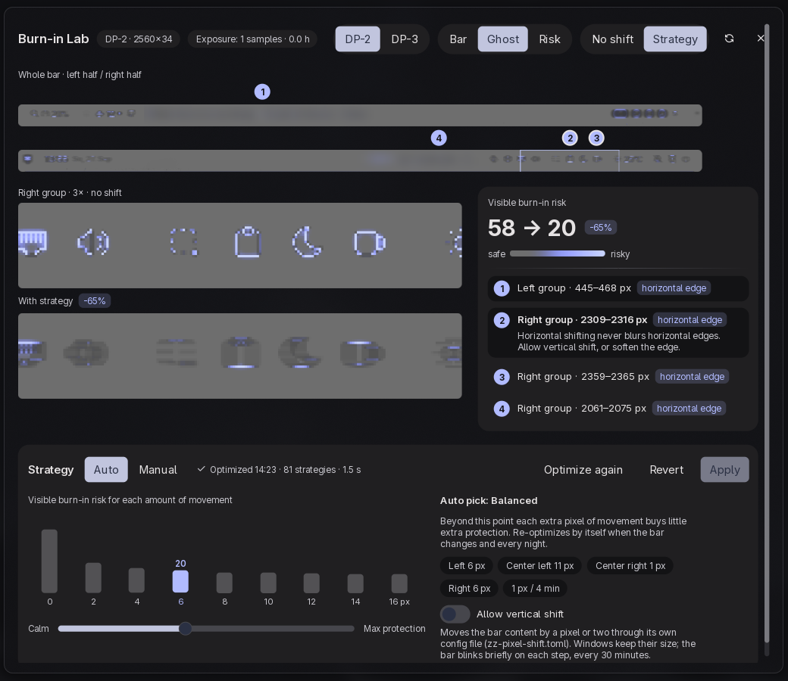
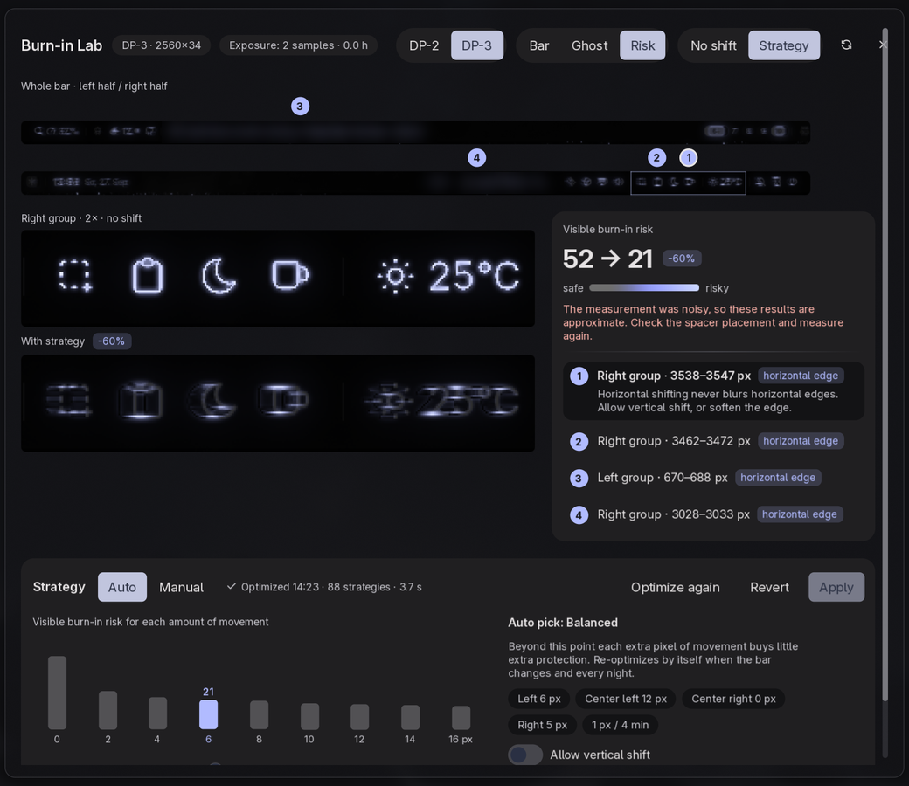
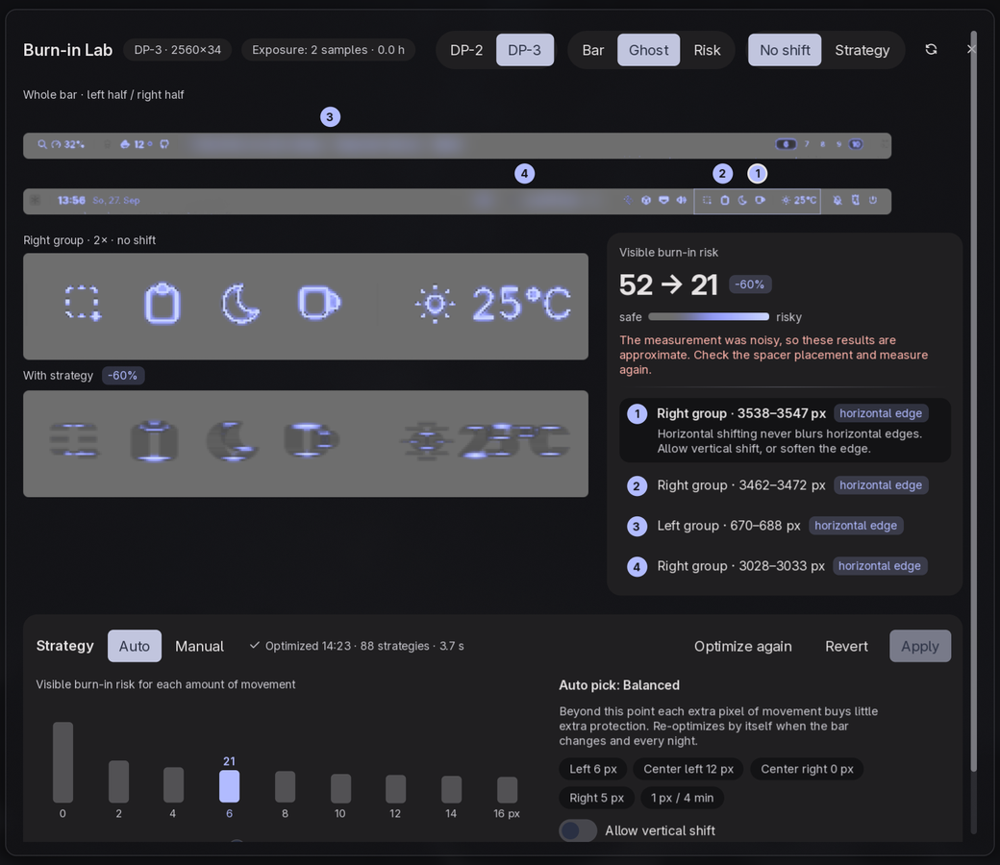

# Pixel Shift for Noctalia

OLED burn-in protection for the [Noctalia](https://github.com/noctalia-dev/noctalia)
bar. Pixel Shift measures your own bar, simulates how its pixels wear, and shifts the
bar's groups by a few pixels in the pattern that leaves the faintest ghost. The
Burn-in Lab shows where the risk is and what shifting cannot fix.



- **Plugin:** [`pixel-shift/`](pixel-shift/) (install from the Noctalia plugin store
  once it is listed, or add this directory as a local plugin source).
- **Usage, settings, IPC:** [`pixel-shift/README.md`](pixel-shift/README.md)
- **Design:** [`docs/superpowers/specs/2026-09-27-pixel-shift-design.md`](docs/superpowers/specs/2026-09-27-pixel-shift-design.md)
- **Live verification and host findings:** [`docs/verification.md`](docs/verification.md),
  [`docs/spikes.md`](docs/spikes.md)

| Risk view | No shift |
| --- | --- |
|  |  |

## Development

```sh
tools/test.sh            # luau unit tests (downloads nothing; put luau 0.740 in .tools/bin or on PATH)
tools/test.sh layout     # only tests whose name contains "layout"
noctalia plugins lint pixel-shift
```

The numeric core lives in `pixel-shift/core/` and runs without Noctalia. The hot
loops are in `core/kernels.luau`; `engine.luau` carries a verbatim copy because
Noctalia gives only a plugin's entry scripts fast builtin calls.
`tools/check-kernels.py` (part of `tools/test.sh`) keeps the two copies identical.

## License

MIT, see [LICENSE](LICENSE).
